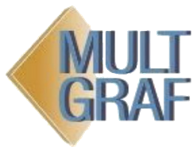
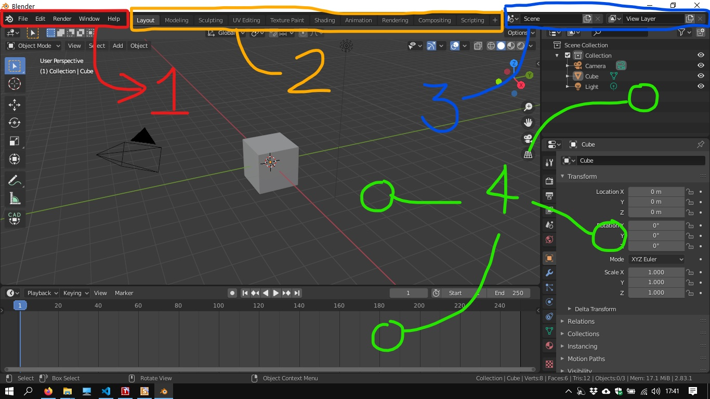
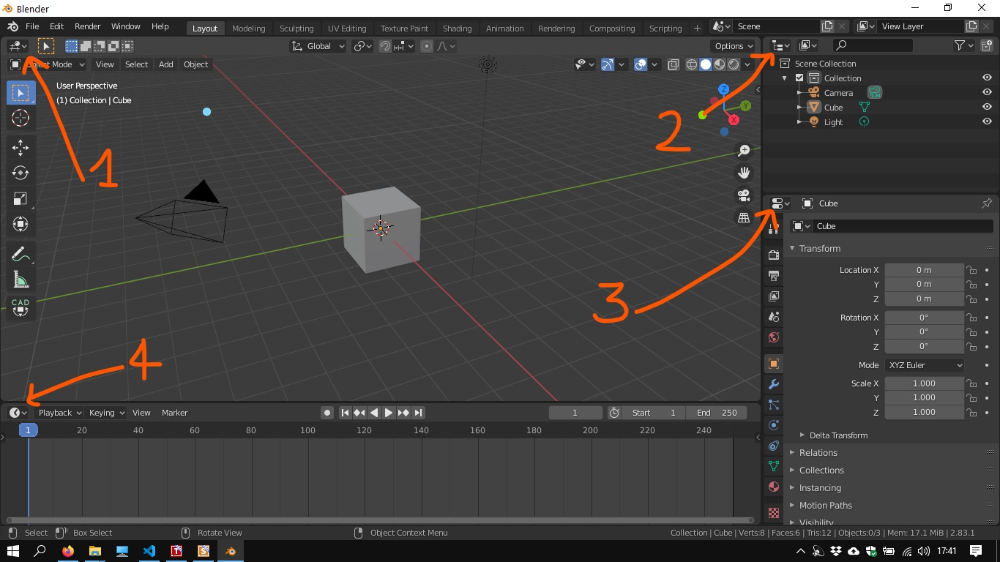
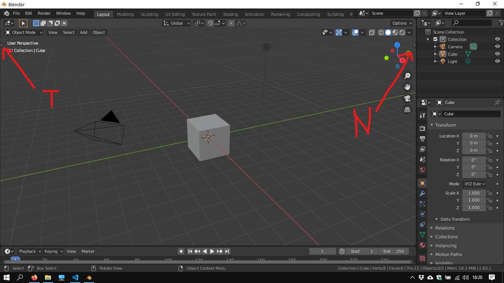
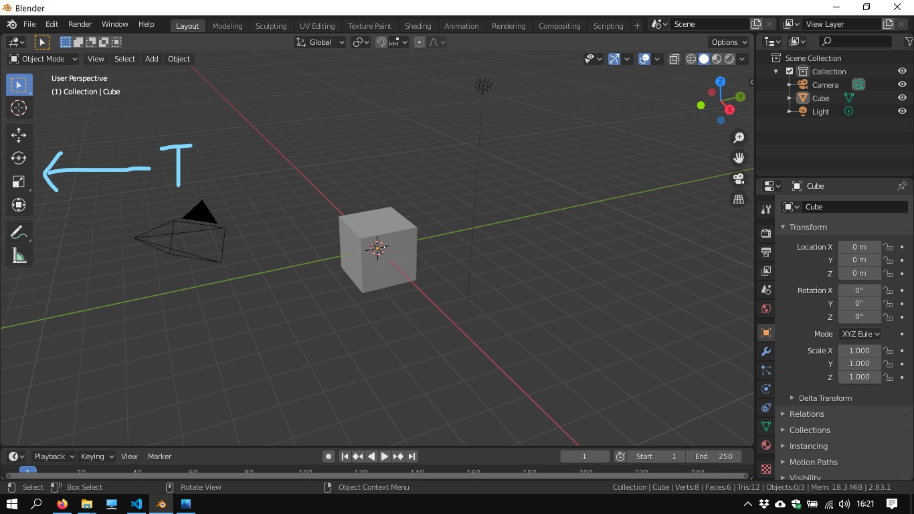
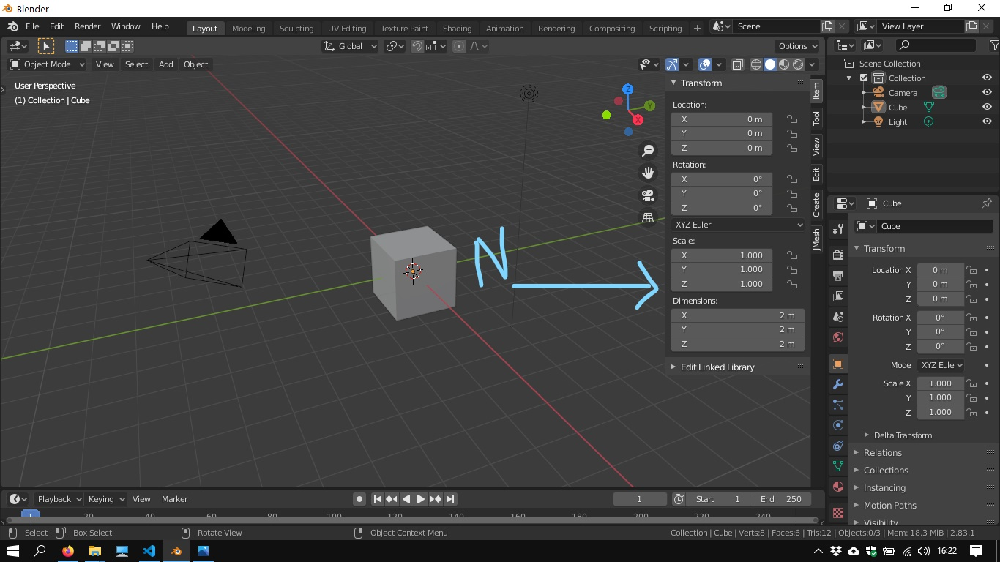
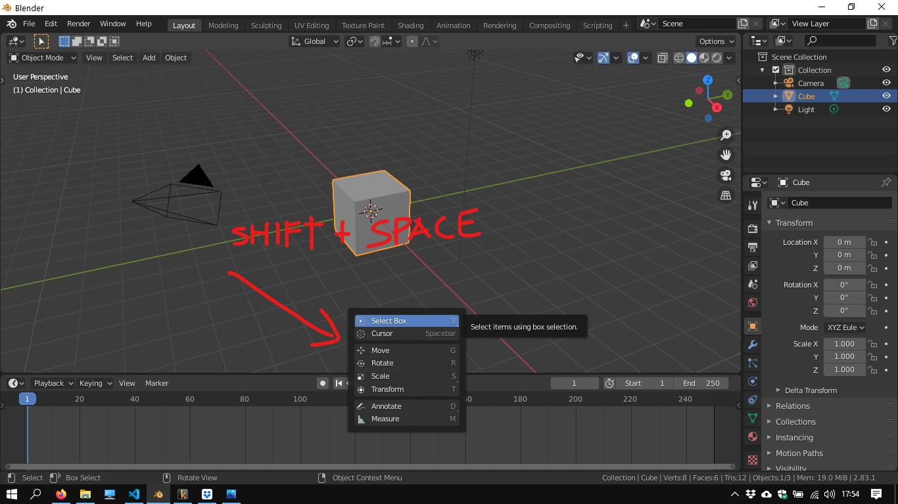
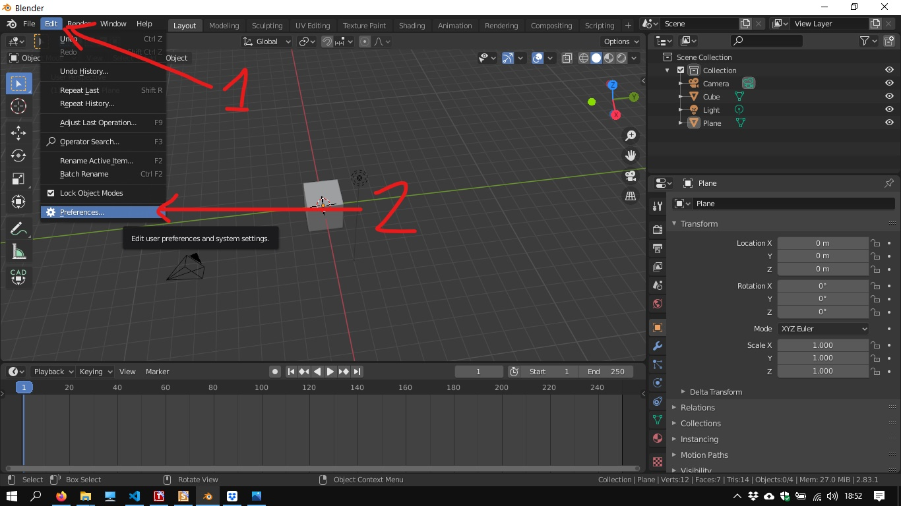

# Sistemas de coordenadas nas Geometrias e no Blender

## Guia da apresentação

  
&emsp;
   
&emsp;
  
&emsp;
  

_____
Apresentado no:
## Seminário NEGSPP / FAUFBA. Competências Digitais para o Ensino-aprendizagem
##### 06/08/2020 10h
por:
#### Fernando Ferraz Ribeiro
#### fernando.ribeiro@ubfa.br
##### [Lattes: http://lattes.cnpq.br/4616226561374562](http://lattes.cnpq.br/4616226561374562)
_____
_____

## Introdução

## Objetivo principal

## Metodologia

## Estrutura da apresentação

### Origens da Geometria

  * geometrias sintéticas e analíticas

### Geometria Euclidiana

### Geometria Analítica (Cartesiana)

  * Coordenadas cartesianas
  * Coordenadas polares

### Geometria Projetiva (Desargues)

[Filippo Brunelleschi 1377-1446](https://pt.wikipedia.org/wiki/Filippo_Brunelleschi)

[Leon Battista Alberti 1404-1472](https://pt.wikipedia.org/wiki/Leon_Battista_Alberti)

[Girard Desargues 1591-1661](https://pt.wikipedia.org/wiki/Girard_Desargues)

[Jean-Victor Poncelet 1788- 1867](https://pt.wikipedia.org/wiki/Jean-Victor_Poncelet)

[David Hilbert 1862-1943](https://en.wikipedia.org/wiki/David_Hilbert)

  * Sistemas de coordenadas homogêneas

### Geometria Descritiva (Mongeana)

_____________
_____________

### Exercícios no Blender

#### Interface

1. Menu do programa (application menu)
2. Abas (tabs)
3. Controles de cena e camadas de visibilidade (Scene and View Layer selection)
4. Editores

Abas servem para trocar entre diferentes configurações de editores.

________________
#### Editores

  1. 3d viewport
  2. Outliner
  3. Properties
  4. Timeline

O atalho ``ctrl + space`` maximiza o editor atual ou retorna para a vista padrão da aba.

________________

#### Paineis T e N

Alguns editores possuem pequenas setas nos lados de duas áreas. Menus podem ser abertos clicando e arrastando nas setas, ou pelos atalhos ``T`` e ``N``.

Abaixo Vemos a indicação das setas no editor 3d Viewport.

No Lado esquerdo, temos o painel de ferramentas (tools panel) que pode ser visto ou escondido teclando ``T``.

No lado direito temos o painel lateral (Sidebar panel), que pode ser mostrado ou recolhido também pela tecla ``N``(como mitos dos ajustes são numéricos, a equipe do Blender escolheu a tecla ``N`` como atalho para este painel)

É comum encontrar estes paineis referidos como ``T`` e ``N`` nos materiais de informação sobre o blender.

Uma outra versão do painel T pode ser vista pressionando as teclas ``shift + space``. 

Uma tabela com botões aparece na posição do ponteiro do mouse, apresentando os mesmos botões do painel de ferramentas. 

________________

#### Modos de trabalho do Menu 3D Viewport

_______________

#### Precisão (snaps)

________________

#### Adções (addons)

##### Addons sugeridos:

  1. [CAD transformations](https://github.com/s-leger/blender_cad_transforms)
  1. [Sverchok](https://github.com/nortikin/sverchok/)
  1. [Sorcar](https://github.com/aachman98/Sorcar)
  1. [Blender Gis](https://github.com/domlysz/BlenderGIS)
  1. [Blender Bim](https://blenderbim.org/)
  1. [Point Cloud vizualizer](https://github.com/uhlik/bpy#point-cloud-visualizer-for-blender-280)
  1. [QBlocker](https://blender-addons.org/qblocker-addon/)

_______________

