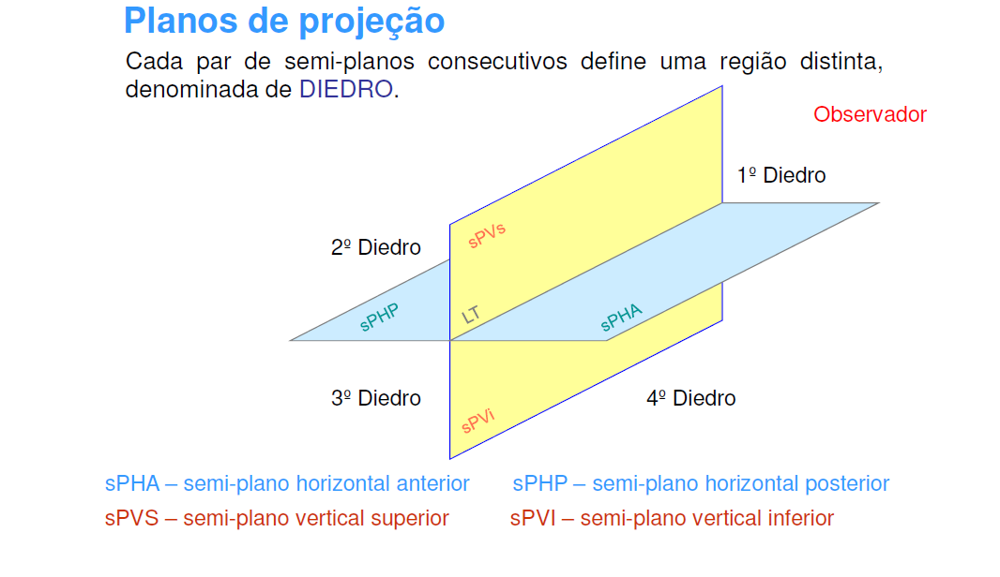

# Sistemas de coordenadas nas Geometrias e no Blender

## Guia da apresentação

  
&emsp;
   
&emsp;
  
&emsp;
  

_____
Apresentado no:
## Seminário NEGSPP / FAUFBA. Competências Digitais para o Ensino-aprendizagem
##### 06/08/2020 10h
por:
#### Fernando Ferraz Ribeiro
#### fernando.ribeiro@ubfa.br
##### [Lattes: http://lattes.cnpq.br/4616226561374562](http://lattes.cnpq.br/4616226561374562)
_____
_____

## Introdução

1. Sobre o seminário de capacitação digital
  Apresentação no congresso da UFBA:
  [Experiências didáticas com o uso de tecnologias digitais no ensino do desenho](https://www.youtube.com/watch?v=DDwek2GkaRI&feature=youtu.be)
2. O ensino de desenho e programas de desenho nos cursos de arquitetura
3. Objetivos da apresentação
   

### Origens da Geometria

.jpg)
###### TOLEDO, M. Didática de matemática: como dois e dois: a construção da Matemática. São Paulo: FTD, 1997 p. 19.

### Geometria Euclidiana

[Euclides de Alexandria - 300 a.C](https://pt.wikipedia.org/wiki/Euclides)

#### Axiomas:
  1.  Coisas que são iguais a uma mesma coisa, são iguais entre si.
  2.  Se iguais são adicionados a iguais, os resultados são iguais.
  3.  Se iguais são subtraídos de iguais, os restos são iguais.
  4.  Coisas que coincidem uma com a outra, são iguais.
  5.   O todo é maior do que qualquer uma das suas partes.

#### Postulados:
  1. Dados dois pontos distintos, há um único segmento de reta que os une;
  2.  Um segmento de reta pode ser prolongado indefinidamente para construir uma reta;
  3.  Dados um ponto qualquer e uma distância qualquer, pode-se construir uma circunferência de centro naquele ponto e com raio igual à distância dada;
  4.  Todos os ângulos retos são congruentes (semelhantes);
  5.  Se duas linhas intersectam uma terceira linha de tal forma que a soma dos ângulos internos em um lado é menor que dois ângulos retos, então as duas linhas devem se intersectar neste lado se forem estendidas indefinidamente. (Postulado de Euclides ou Postulado das Paralelas)

###### fonte: EUCLID. Euclid’s Elements of Geometry. 2nd. ed. [s.l.]: Richard Fitzpatrick, 2008.

### Geometria Analítica (Cartesiana)

[René Descartes 1596-1650](https://pt.wikipedia.org/wiki/Ren%C3%A9_Descartes)

  * Coordenadas cartesianas

###### fonte:[https://pt.wikipedia.org/wiki/Sistema_de_coordenadas_cartesiano#/media/Ficheiro:Cartesian-coordinate-system.svg](https://pt.wikipedia.org/wiki/Sistema_de_coordenadas_cartesiano#/media/Ficheiro:Cartesian-coordinate-system.svg)

  * Coordenadas polares

###### fonte:[https://pt.wikipedia.org/wiki/Coordenadas_polares#/media/Ficheiro:Examples_of_Polar_Coordinates.svg](https://pt.wikipedia.org/wiki/Coordenadas_polares#/media/Ficheiro:Examples_of_Polar_Coordinates.svg)

### Geometria Projetiva (Desargues)

[Filippo Brunelleschi 1377-1446](https://pt.wikipedia.org/wiki/Filippo_Brunelleschi)

[Leon Battista Alberti 1404-1472](https://pt.wikipedia.org/wiki/Leon_Battista_Alberti)

[Girard Desargues 1591-1661](https://pt.wikipedia.org/wiki/Girard_Desargues)

[Jean-Victor Poncelet 1788- 1867](https://pt.wikipedia.org/wiki/Jean-Victor_Poncelet)

[David Hilbert 1862-1943](https://en.wikipedia.org/wiki/David_Hilbert)

  * [Sistemas de coordenadas homogêneas](https://en.wikipedia.org/wiki/Homogeneous_coordinates)
  

###### fonte:[https://en.wikipedia.org/wiki/Homogeneous_coordinates#/media/File:RationalBezier2D.svg](https://en.wikipedia.org/wiki/Homogeneous_coordinates#/media/File:RationalBezier2D.svg)

  * [Matriz de transformação](https://en.wikipedia.org/wiki/Transformation_matrix)

###### fonte:[https://en.wikipedia.org/wiki/Transformation_matrix#/media/File:2D_affine_transformation_matrix.svg](https://en.wikipedia.org/wiki/Transformation_matrix#/media/File:2D_affine_transformation_matrix.svg)

### Geometria Descritiva (Mongeana)

[Gaspar Monge  1746-1818](https://pt.wikipedia.org/wiki/Gaspard_Monge)

###### fonte:[https://pt.wikipedia.org/wiki/Geometria_descritiva#/media/Ficheiro:Kegelzylinder-mantellinienverf.png](https://pt.wikipedia.org/wiki/Geometria_descritiva#/media/Ficheiro:Kegelzylinder-mantellinienverf.png)

###### fonte: Material de aula da disciplina ARQA20 - Desenho Projetivo. Elaborado pela professora Natalie Johanna Groetelaars

###### fonte: Material de aula da disciplina ARQA20 - Desenho Projetivo. Elaborado pela professora Natalie Johanna Groetelaars
_______
### Sistemas de coordenadas em computação gráfica

Sistemas de coordenada do objeto e do mundo

Criação do sistema de coordenadas da imagem

###### fonte: [https://en.wikibooks.org/wiki/Game_Creation_with_XNA/3D_Development/Camera_and_Lighting#Coordinate_Systems](https://en.wikibooks.org/wiki/Game_Creation_with_XNA/3D_Development/Camera_and_Lighting#Coordinate_Systems)

______
_____________

### Exercícios no Blender

#### Site oficial

[blender.org](https://www.blender.org/)

[Download](https://www.blender.org/download/)

[Desenvolvimento do Blender](https://code.blender.org/2020/02/release-planning-2020-2025/?utm_source=www-homepage)

#### Interface

[Documentação](https://docs.blender.org/manual/en/2.83/interface/index.html#user-interface)

1. Menu do programa (application menu)
2. Abas (tabs)
3. Controles de cena e camadas de visibilidade (Scene and View Layer selection)
4. Editores

Abas servem para trocar entre diferentes configurações de editores.

________________
#### Editores

[Documentação](https://docs.blender.org/manual/en/2.83/editors/index.html#editors)

  1. 3d viewport
  2. Outliner
  3. Properties
  4. Timeline

O atalho ``ctrl + space`` maximiza o editor atual ou retorna para a vista padrão da aba.

________________

#### Painéis T e N

Alguns editores possuem pequenas setas nos lados de duas áreas. Menus podem ser abertos clicando e arrastando nas setas, ou pelos atalhos ``T`` e ``N``.

Abaixo Vemos a indicação das setas no editor 3d Viewport.

No Lado esquerdo, temos o painel de ferramentas (tools panel) que pode ser visto ou escondido teclando ``T``.

No lado direito temos o painel lateral (Sidebar panel), que pode ser mostrado ou recolhido também pela tecla ``N``(como muitos dos ajustes são numéricos, a equipe do Blender escolheu a tecla ``N`` como atalho para este painel)

É comum encontrar estes paineis referidos como ``T`` e ``N`` nos materiais de informação sobre o blender.

Uma outra versão do painel T pode ser vista pressionando as teclas ``shift + space``. 

Uma tabela com botões aparece na posição do ponteiro do mouse, apresentando os mesmos botões do painel de ferramentas. 

________________

#### Modos de Trabalho do Editor 3D Viewport

Os modos de trabalho ([object modes](https://docs.blender.org/manual/en/2.83/editors/3dview/modes.html#object-modes) podem ser selecionados pela barra superior esquerda do editor 3d viewport.

Selecione um dos objetos da cena e clique na seta do seletor de modos como na figura acima.

Apenas dois modos de objeto serão apresentados neste momento, **Object Mode** e o **Edit Mode**. A tecla ``Tab`` alterna automaticamente entre estes dois modos.

**Observação:** note que, quando mudamos de modo os painéis mostram algumas opções diferentes.

_______________

#### Precisão (snaps & pivots)

Comandos de precisão do Blender.

Pontos pivots de transformação do Blender.

________________

#### Adções (add-ons)

Acima vemos uma das maneiras de se abrir o menu de preferências.

Na opção Add-ons podemos ver uma série de adições que já vem embarcadas no Blender e podemos instalar outras, baixadas da internet. Alguns são gratuitos e outros pagos.

##### Add-ons sugeridos (gratuitos - disponíveis na internet):

  1. [CAD transformations](https://github.com/s-leger/blender_cad_transforms)
  1. [Sverchok](https://github.com/nortikin/sverchok/)
  1. [Sorcar](https://github.com/aachman98/Sorcar)
  1. [Blender Gis](https://github.com/domlysz/BlenderGIS)
  1. [Blender Bim](https://blenderbim.org/)
  1. [Point Cloud vizualizer](https://github.com/uhlik/bpy#point-cloud-visualizer-for-blender-280)
  1. [QBlocker](https://blender-addons.org/qblocker-addon/)
  1. [Jmesh](https://github.com/jayanam/jmesh-tools)

_______________

#### Sistemas de coordenadas

1. Global
2. Local
3. Normal
4. Gimbal
5. view
6. Cursor
7. Adicionar outros

________________